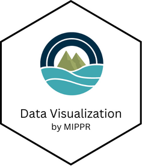

# Data Visualization Tool 

[

# Description

Welcome to the Data Visualization webpage. This tool displays visual characteristics and concentrations of microplastics through plots, tables, and maps. The first two tabs uses microplastics sample data from the California Open Data Portal and allows users to look at the concentration of microplastics by cities or countries. The last tab uses data that is entirely simulated for illustrative purposes to demonstrate the functionality of the application, including displaying yearly average concentrations, treatment levels, and polymer and width distributions.

# Installation

- Use the web app: https://moore-institute-4-plastic-pollution-res.github.io/microplastic_analysis_WebR/

- The code for the app is in [app.R](https://github.com/Moore-Institute-4-Plastic-Pollution-Res/microplastic_analysis_WebR/blob/main/app.R)
